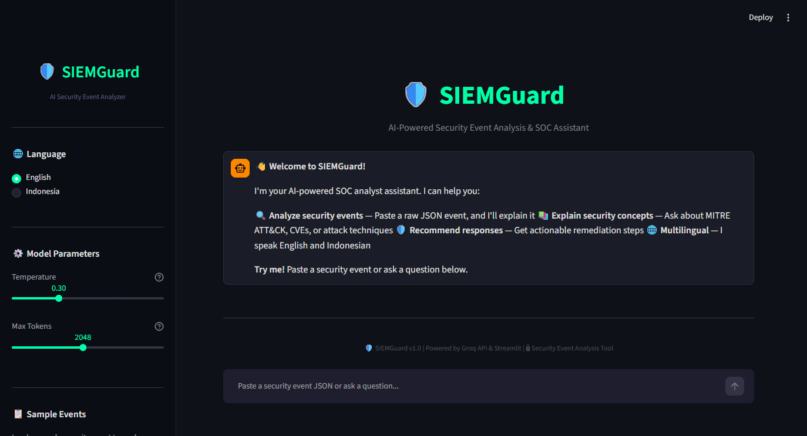

# 🛡️ SIEMGuard — AI Security Event Analyzer

A Streamlit-based chatbot that helps SOC analysts analyze security events using Groq API (LLaMA 3.3 70B).

## Features

- **🔍 Event Analysis**: Paste raw JSON security events and get instant analysis
- **🎯 MITRE ATT&CK Mapping**: Events mapped to tactics and techniques
- **🔄 Cyber Kill Chain**: Identify attack lifecycle phases
- **🌐 Multilingual**: English & Indonesian language support
- **🌙 Dark Mode**: Professional cyber-security themed UI
- **💾 Conversation Memory**: Chat history preserved during session
- **📤 Export**: Download chat history as text file
- **⚙️ Adjustable Parameters**: Temperature & Max Tokens control
- **📋 Sample Events**: 20 pre-loaded security events for testing

## Tech Stack

| Component | Technology |
|---|---|
| Frontend | Streamlit 1.58+ |
| LLM API | Groq API (LLaMA 3.3 70B) |
| Python | 3.14+ |

## Installation

1. **Clone the repository**
   ```bash
   git clone https://github.com/yehezkieltatang/final-project-llm-hacktiv.git
   cd final-project-llm-hacktiv
   ```

2. **Install dependencies**
   ```bash
   pip install -r requirements.txt
   ```

3. **Configure API Key**
   ```bash
   cp .env.example .env
   ```
   Edit `.env` and add your Groq API key:
   ```
   GROQ_API_KEY=gsk_your_key_here
   ```
   Get a key at [console.groq.com](https://console.groq.com/keys)

4. **Run the app**
   ```bash
   streamlit run app.py
   ```

## Usage

1. **Select Language**: Toggle English/Indonesia in sidebar
2. **Load Sample Events**: Pick from 20 pre-loaded security events
3. **Paste Your Events**: Paste raw JSON security events in chat
4. **Ask Questions**: Ask about security concepts, CVEs, or best practices
5. **Export**: Download your analysis session

## Sample Event Structure

The sample events are from a NOGTUS Apex SIEM platform with fields like:
- Alert signatures (ET SURICATA rules)
- MITRE ATT&CK mapping
- GeoIP data (source/destination locations)
- Flow details (packets, bytes)
- Cyber Kill Chain classification

## Project Structure

```
final-project-llm-hacktiv/
├── app.py                    # Main Streamlit application
├── requirements.txt          # Python dependencies
├── .env.example              # Environment template
├── .gitignore
├── README.md
├── data/
│   └── apex_alert_202607060956.json  # 20 sample events
├── utils/
│   ├── __init__.py
│   ├── groq_client.py        # Groq API wrapper
│   ├── chat_manager.py       # Session & memory management
│   └── prompts.py            # System prompts (EN/ID)
└── .streamlit/
    └── config.toml           # Dark theme configuration
```

## Screenshots

### Main Chat Interface (Dark Mode)


### Event Analysis


## License

This project was created as a final project for LLM course at Hacktiv8.